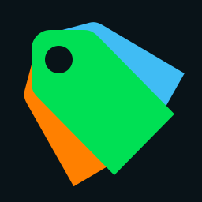

<div align="center">
  
  <h1>letterboxd-badge 🎬</h1>
  <p>Showcase your cinematic tastes in your README with a personalized Letterboxd badge!</p>
</div>

## Usage
Generate a simple badge by adding the following markdown to your README:
```markdown

```
or with a custom redirect link
```markdown
[](<link-to-redirect-when-badge-clicked>)
```
Illustration of the letterboxd badge:


## Options / Customization

You can customize your URL by passing various options. Here’s an example of how to use them:

```
url?option1=valueofoption1&option2=valueofoption2
```

### Available Options:

| **Option**      | **Description**                                                              | **Values**                                                                 |
|-----------------|------------------------------------------------------------------------------|---------------------------------------------------------------------------|
| `theme`         | Choose the appearance theme for the display.                                  | `classic`: Matches the Letterbox Dark theme.<br>`colorMatch`: Matches the theme to the film cover. |
| `index`   | Specifies which review to display based on its index.                        | `number`: 0 for the most recent review, 1 for the one before that, etc.   |

### Example:

To use the `classic` theme and show the second most recent review, your URL would look like this:

```
url?theme=classic&reviewIndex=1
```

## Important Note ❗
This is not an official Letterboxd service.

Here’s an improved version of your README with a better-structured table for clarity and easier reference:
